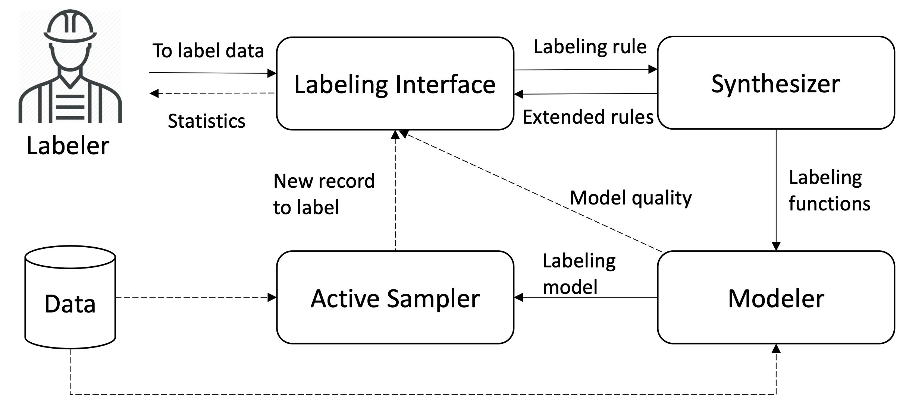

# RULER: Data Programming by Demonstration for Text 
 
This repo contains the source code and the user evaluation data and analysis scripts for Ruler, a data programming by interactive demonstration system for document labeling. Ruler synthesizes labeling rules using span-level annotations that  represent users’ rationales or explanations for their labeling decisions on document examples (see our [EMNLP'20 submission](media/Ruler_EMNLP2020.pdf) for details). 


**Check out our [demo video](https://drive.google.com/file/d/1iOQt81VDg9sCPcbrMWG8CR_8dOCfpKP5/view?usp=sharing) to see Ruler in action on a spam classification task, or [try it yourself](http://54.83.150.235:3000/) on a sentiment analysis task.**

<h3 align="center">

</h3>

1. [What is Data Programming by Demonstration? (DPBD)](#DPBD)
2. [Ruler: DPBD for Text](#Ruler)
3. [Evaluation of Ruler](#Eval)
3. [How to Use the Source Code in This Repo](#Use)
   - [Engine](#Engine)
   - [User Interface](#UI)


## <a name='DPBD'></a>What is Data Programming by Demonstration (DPBD)?

The success of machine learning has dramatically increased the demand for high-quality labeled data---but this data is 
expensive to obtain, which inhibits broader utilization of machine learning models outside resource rich settings. 
That's where data programming [[1](https://arxiv.org/pdf/1605.07723.pdf), [2](https://arxiv.org/pdf/1711.10160.pdf)] 
comes in. Data programming aims to address the difficulty of collecting labeled data using a 
programmatic approach to weak supervision, where domain (subject-matter) experts are expected to provide functions
incorporating their domain knowledge to label a subset of a large training dataset. Since these labeling functions
may overlap or conflict with each other, they are denoised (i.e., the optimum corresponding weights are learned)
using inference over a generative graphical model. The denoised functions are then applied to the large unlabeled 
dataset to obtain probabilistic labels and train standard machine learning models in a noise-aware manner. Writing data programs or labeling functions can be, however, challenging. Most domain experts or lay users do not 
have programming literacy. Crucially, it is often difficult to convert domain knowledge to a set of rules 
through enumeration even for those who are proficient programmers. The accessibility of writing labeling functions is a 
challenge for wider adoption of data programming.

<h3 align="center">

Overview of the data programming by demonstration (DPBD) framework. Straight lines indicate the flow of domain
knowledge, and dashed lines indicate the flow of data.
<br/>
</h3>

To address this challenge, we introduce a new framework, __Data Programming by 
Demonstration (DPBD)__, to synthesize labeling functions through user interactions. DPBD aims to move the burden of 
writing labeling functions to an intelligent synthesizer while enabling users to steer the synthesis process at multiple
semantic levels, from providing rationales relevant for their labeling choices to interactively
filtering the proposed functions.  As a result, DBPB allows users to interactively label few examples 
to demonstrate what labeling functions should do, instead of manually writing these functions. 

## <a name='Ruler'></a>Ruler: DPBD for Text

<h3 align="center">

</h3>

Ruler is an interactive tool that operationalizes data programming by demonstration for document text. To that end, it 
enables users to effectively sample (navigate) examples using active learning and label these examples while expressing  
the rationales for labels by interactively annotating spans and their relations. Ruler then  automatically suggests labeling 
functions for users to choose and refine from. Users also get continuous visual feedback about how their labeling functions are performing.

<h3 align="center">
By limiting users' task to simple annotation and selection from suggested rules, <br/>
we allow fast exploration over the space of labeling functions.
 <br/>

</h3>


**This allows users to focus on**

  :white_check_mark: choosing the right generalization of observed instances

  :white_check_mark: capturing the tail end of their data distribution

**and avoid worrying about**

  :x: implementation details in a programming language

  :x: how to express rules in natural language

  :x: how to formalize their intuition
  
  
## <a name='Eval'></a>Evaluation

We conducted a user study with 10 data scientists and measured  their task performance accuracy in completing two prevalent labeling tasks: spam detection and sentiment classification.  They performed these two tasks on  [YouTube Comments](https://archive.ics.uci.edu/ml/datasets/YouTube+Spam+Collection) and [Amazon Reviews](https://www.kaggle.com/bittlingmayer/amazonreviews), respectively. In addition to task performance, we also analyzed the accessibility and  expressivity of both methods using the qualitative feedback elicited from participants and our observations gathered during the study sessions. 


All participants had significant programming experience (avg=12.1 years, std=6.5). Their experience with Python programming ranged from 2 to 10 years with an average of 5.2 years (std=2.8).  

We find that Ruler and Snorkel provide comparable model performances (see figure below). The logistic regression models trained on data produced by labeling models created using Ruler have slightly higher f1 (W=35, p=0.49, r=0.24 ), precision (W=30, p=0.85, r=0.08), and recall (W=25, p=0.85, r=0.08) scores on average. Conversely, accuracy is slightly higher (W=17, p=0.32, r=0.15) for Snorkel models on average than Ruler. However these differences are not statistically significant. 

<h3 align="center">

<br />  Ruler and Snorkel provide comparable model performances
</h3>


Participants find Ruler to be significantly easier to use 
(W=34, p=0.03 < 0.05, r=0.72) than Snorkel. 
Similarly, they consider Ruler easier to learn (W=30, p=0.1, r=0.59) than Snorkel.  On the other hand, as we expected, participants report Snorkel to be more expressive (W=0, p=0.05, r=0.70)  than  Ruler. However, our participants appear to consider accessibility (ease of use and ease of learning) to be more important criteria, rating Ruler higher (W=43, p=0.12, r=0.51) than Snorkel for overall satisfaction.  


<h3 align="center">

<br/>Participants' subjective ratings on ease of use, expressivity, ease of learning and overall satisfaction, on a 5-point Likert scale. 
</h3>

The data from our user study is available [here](https://github.com/rulerauthors/ruler/tree/master/user_study), along with [the code to generate all of our figures](https://github.com/rulerauthors/ruler/blob/master/user_study/ruler_user_study_figures.ipynb).

# <a name='Use'></a>How to use the source code in this repo

Follow these instructions to run the system on your own, where you can plug in your own data and save the resulting labels, models, and annotations.

## <a name='Engine'></a>Engine

The server runs on [Flask](https://flask.palletsprojects.com/en/1.1.x/) and can be found in [`server/`](server/). 

### 1. Install Dependencies :wrench:

```shell
cd server
pip install -r requirements.txt
```

### 2. Upload Data :memo:

To run the Youtube Spam Classification task shown in the demo, download the data files [here](https://www.kaggle.com/goneee/youtube-spam-classifiedcomments) and place them under `data/`.
There should be five files.

 __Want to use Another Dataset?__ 

 Open `server/api/idea2.py`. 
 You'll want to replace `load_youtube_dataset` with your own function. 
 The return value of this function should be 4 [pandas DataFrames](https://pandas.pydata.org/pandas-docs/stable/reference/api/pandas.DataFrame.html) (training, development, validation, and test sets).  
 
 Your dataframes must have:
  - A `label` column: an integer value describing which class the example belongs to. (The training dataframe doesn't need this column).
  - A `text` column: the text to be annotated.
  - A unique [index](https://pandas.pydata.org/pandas-docs/stable/reference/api/pandas.Index.html?highlight=index#pandas.Index). You can use the `[reset_index](https://pandas.pydata.org/pandas-docs/stable/reference/api/pandas.DataFrame.reset_index.html)` function to do this.
 
For an example, see `server/data/preparer.py`.

In `server/api/idea2.py`, you should also change the variables `MODE` and `USER` to something descriptive. This will dictate the directory where your models are saved, should you choose to save them.

### 3. Run :runner:

```
python api/server.py
```

Open your browser, and got to http://localhost:5000/api/ui

This will display a [Swagger UI](https://swagger.io/tools/swagger-ui/) page that allows you to interact directly with the API.

### 4. Save Your Model (Optional) :floppy_disk:

Via Ruler UI: 

Click the save button in the top right corner.


Via the API :

Submit a post request to `http://localhost:5000/save`. 


The snorkel model, concepts, labelling function history, and interaction history will all be in the directory `<USER>/<MODE>`.
By default this is `guest/Youtube`.


## <a name='UI'></a>User Interface


The user interface is implemented in [React JavaScript Library](https://reactjs.org). The code can be found in [`ui/`](ui/).

### 1. Install Node.js

[You can download node.js here.](https://nodejs.org/en/)

To confirm that you have node.js installed, run `node - v`

### 2. Run

```shell
cd ui
npm install 
npm start
```

By default, the app will make calls to `localhost:5000`, assuming that you have the server running on your machine. (See the [instructions above](#Engine)).

Once you have both of these running, navigate to `localhost:3000`.

**You can also try our live demo [here](http://54.83.150.235:3000).**

